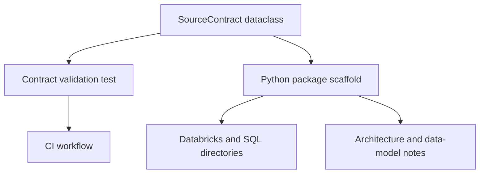

# Current scaffold architecture

**State:** Implemented

```mermaid
flowchart TD
    A[SourceContract dataclass]
    B[Contract validation test]
    C[Python package scaffold]
    D[Databricks and SQL directories]
    E[Architecture and data-model notes]
    F[CI workflow]

    A --> B
    A --> C
    B --> F
    C --> D
    C --> E
```

No generator, Bronze/Silver/Gold pipeline, Delta table, Databricks job, benchmark, or deployment is represented as implemented.

