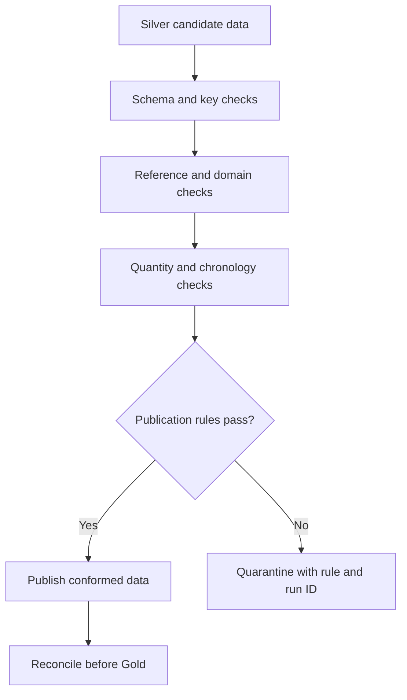

# Quality and publication flow

**State:** Planned

```mermaid
flowchart TD
    A[Silver candidate data]
    B[Schema and key checks]
    C[Reference and domain checks]
    D[Quantity and chronology checks]
    E{Publication rules pass?}
    F[Publish conformed data]
    G[Quarantine with rule and run ID]
    H[Reconcile before Gold]

    A --> B
    B --> C
    C --> D
    D --> E
    E -->|Yes| F
    E -->|No| G
    F --> H
```

