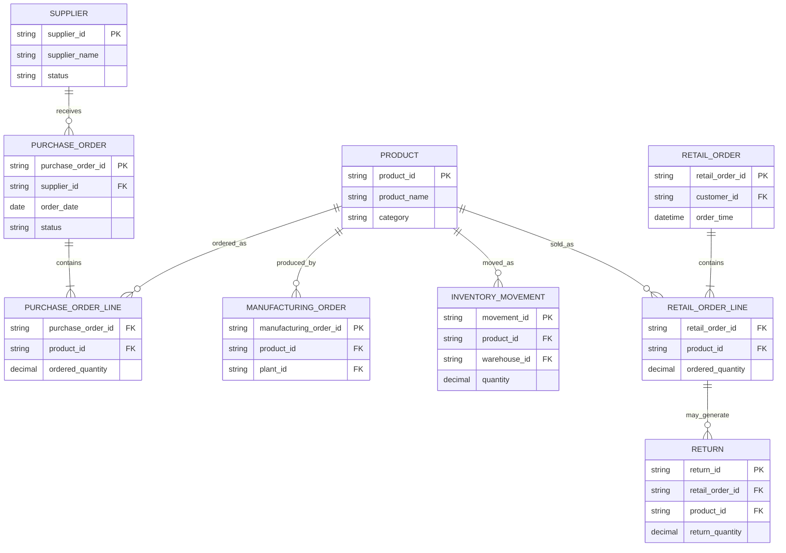

# Conceptual supply-chain ER model

**State:** Proposed

```mermaid
erDiagram
    SUPPLIER ||--o{ PURCHASE_ORDER : receives
    PURCHASE_ORDER ||--|{ PURCHASE_ORDER_LINE : contains
    PRODUCT ||--o{ PURCHASE_ORDER_LINE : ordered_as
    PRODUCT ||--o{ MANUFACTURING_ORDER : produced_by
    PRODUCT ||--o{ INVENTORY_MOVEMENT : moved_as
    RETAIL_ORDER ||--|{ RETAIL_ORDER_LINE : contains
    PRODUCT ||--o{ RETAIL_ORDER_LINE : sold_as
    RETAIL_ORDER_LINE ||--o{ RETURN : may_generate

    SUPPLIER {
        string supplier_id PK
        string supplier_name
        string status
    }
    PRODUCT {
        string product_id PK
        string product_name
        string category
    }
    PURCHASE_ORDER {
        string purchase_order_id PK
        string supplier_id FK
        date order_date
        string status
    }
    PURCHASE_ORDER_LINE {
        string purchase_order_id FK
        string product_id FK
        decimal ordered_quantity
    }
    MANUFACTURING_ORDER {
        string manufacturing_order_id PK
        string product_id FK
        string plant_id FK
    }
    INVENTORY_MOVEMENT {
        string movement_id PK
        string product_id FK
        string warehouse_id FK
        decimal quantity
    }
    RETAIL_ORDER {
        string retail_order_id PK
        string customer_id FK
        datetime order_time
    }
    RETAIL_ORDER_LINE {
        string retail_order_id FK
        string product_id FK
        decimal ordered_quantity
    }
    RETURN {
        string return_id PK
        string retail_order_id FK
        string product_id FK
        decimal return_quantity
    }
```

Entity grains, surrogate keys, and history policies remain design work until source contracts and transforms are implemented.

